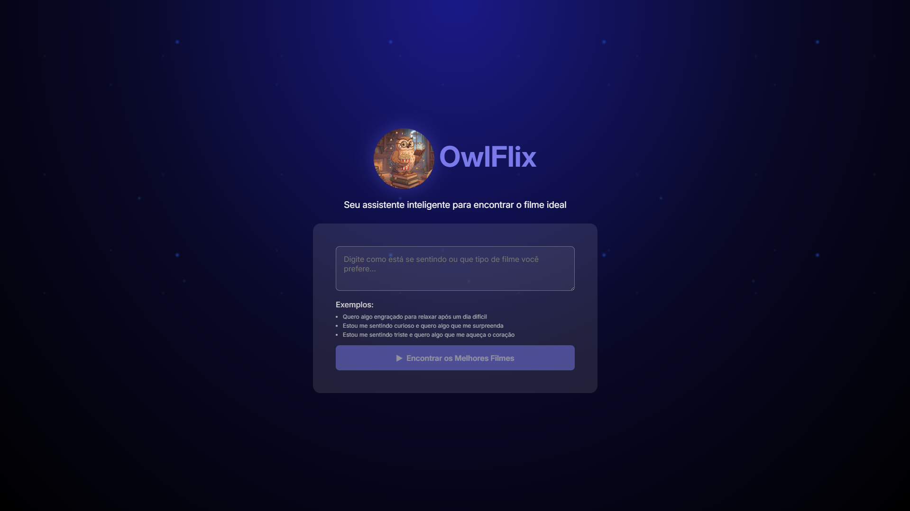
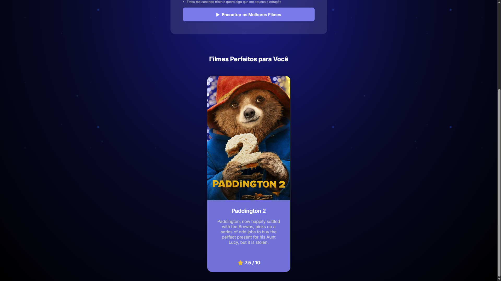

# 🦉 OwlFlix
O OwlFlix é um site que recomenda filmes com IA após o usuário digitar um humor ou um gênero entregando o cartaz, sinopse e nota.

## 🛠️ Tecnologias utilizadas
- HTML
- CSS
- JavaScript
- API de filmes (TMDB)
- Integração com IA do Gemini
- Utilização do n8n para automação e orquestração dos fluxos

## 💻 Como usar
1. Digite seu humor ou estilo de filme
2. Clique em buscar
3. Receba a sugestão personalizada de filme

## 🔗 Acesse o projeto
[Acesse o Projeto](https://kaianmuniz.github.io/owlflix/)

## 📸 Preview

## ⚠️ Observações
Alguns filmes podem não ter avaliação pois não possuem votos suficientes na API

Projeto desenvolvido como estudo prático de front-end e integração com IA.